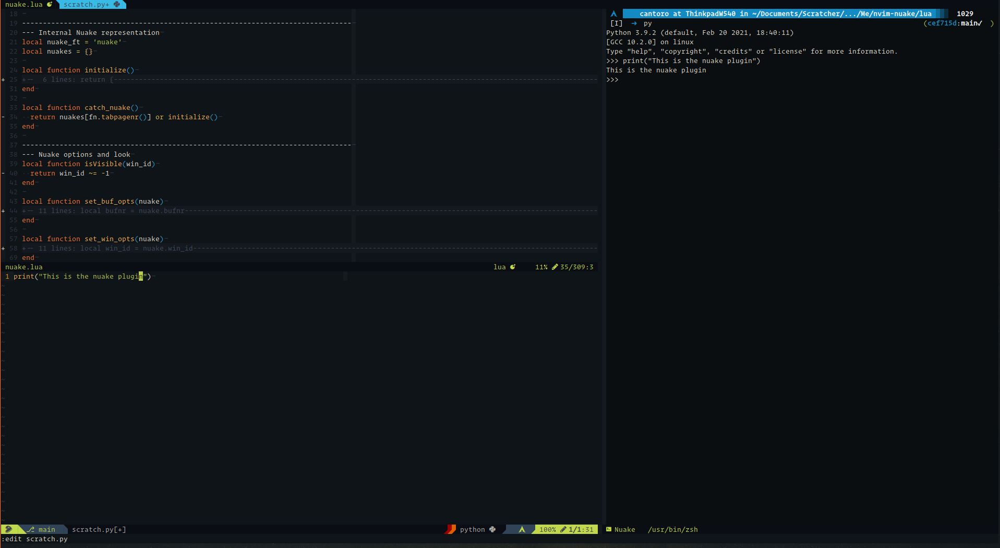

# Nvim-Nuake
A NeoVim plugin written in Lua that wraps around the built-in NeoVim terminal,
  inspired by [Lenovsky/nuake](https://github.com/Lenovsky/nuake) and [akinsho/nvim-toggleterm.lua](https://github.com/akinsho/nvim-toggleterm.lua).


## Functionalities
  The plugin is meant to provide a quick access to the builtin terminal with, in my opinion, good buffer and windows option.
  Just one Nuake instance is allowed per-tab, for additional terminal you should rely on the builtin terminal.

### Toggle
Command `NuakeToggle`, toggle on/off the nuake terminal
```vim
command! -nargs=0 NuakeToggle lua require'nuake'.toggle()
```

Mapping to the toggle command is by default `<C-\>` but can be changed with
```vim
nmap <C-\> <Plug>NuakeToggle
```

### Execute
Command `NuakeExec cmd` open a nuake instance and spawn the command
```vim
command! -nargs=* -complete=shellcmd NuakeExec lua require'nuake'.exec(<q-args>)
```

### Repl
These functionalities are used to send to the current tab's nuake the desired text from the current buffer.
  Commands `NuakeSendLine`, `NuakeSendParagraph`, `NuakeSendBuffer`, and `NuakeSendSelection`.

Mappings (here the default values Emacs style)
```vim
nmap <C-\><C-c><C-l> <Plug>NuakeSendLine
nmap <C-\><C-c><C-p> <Plug>NuakeSendParagraph
nmap <C-\><C-c><C-b> <Plug>NuakeSendBuffer
xmap <C-\><C-c>      <Plug>NuakeSendSelection
```
The first three mappings use tpope (the lord of the Vims) [vim-repeat](https://github.com/tpope/vim-repeat) to allow to repeat the action with the `.-operator`.
The first two allow also a count before the mappings in order to specify the numbers of lines and paragraphs(delimited by empty lines).

## Usage
```lua
require'nuake'.setup{
  view = {
    floating = true,
    buffer = {
      position = 'bottom',
      rel_size = 0.4,
    },
    float = {
      position   = 'center',
      rel_height = 0.4,
      rel_width  = 0.8,
    },
  },
  close_if_last_standing = true,
  start_in_insert        = true,
  filetype               = 'nuake',
}
```
Possible values for position are 'right', 'left', 'top' and 'bottom'.

## Issues and Todos
1. If a nuake instance has not already being created, then the using the "REPL" commands only opens nuake but don't send the text (you have to recall it). (I have not figure out why)
